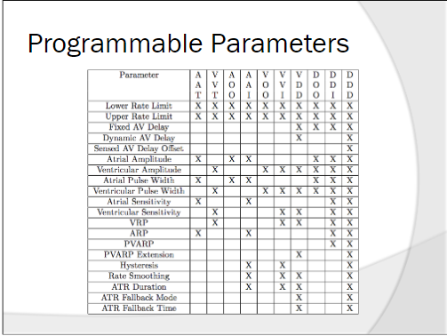

[toc]

# Background Info

## Requirement

1. The self rate must not be too fast 
2. The self rate must not be too slow 
3. The ventricles must contract at a particular interval after the atria contract 

# Pacemaker System

## System Components: Device

- Detects and provides therapy for bradycardia conditions 

- Provides programmable, single- and dual-chamber, rate-adaptive pacing, both permanent and temporary 
- May measure physical activity resulting in a sensor indicated rate for pacing the self
- Provides sensor output data and rate histograms 
- Provides diagnostic features including 
  - Real-time telemetry markers 
  - EGMs 
  - P and R wave measurements 
  - Lead impedance 
  - Battery status tests 

## System Components: Device Controller-Monitor 

- Primary implant, pre-discharge  electrophysiology (EP) support, and follow-up device for the pacemaker system 
- Programs and interrogates the device 
- Commands delivery of a “Pace Now” pace 
- Acquires and shows diagnostics and lead signal measurement information, sensor history and trending information, and multi-channel monitoring
- Monitors battery status 

## System Components: Lead System 

- Implanted in the patient 
- Allows the device to sense intrinsic activity of the self’s electrical signals 
- Delivers pacing therapy to the patient’s self 
- Leads are connected to the pulse generator via its header

# Pacemaker Operating States

## Permanent state (main)

> Normal state of operation

## Temporary Pacing

> Used to test system parameters or provide patient diagnostic testing

## Magnet State

> Battery status

# Basic process
> Class self controller encapsulates 10 mode calls 
> 
> User input / preset other necessary parameters
1. startup entry is class environment
2. class IO is responsible for receiving data and forwarding it
3. class self controller receives the data and invokes the methods of the specified mode
4. the method in class spacemaker is activated and returns data such as stimulation time/voltage by calculation, while choosing whether to activate class accelerometer or not, depending on the situation
5. 
- If activated, the specified parameters are passed to lead for processing, depending on the situation.
- If not activated, pass directly to lead
6. lead passes the data to heart_controller
7. then start the next loop

# Project Structure
## Accelerometer
> If the self is too fast/slow, call the corresponding method to return the parameters

## Environment
> The entry point of the whole project, responsible for calling the specified module according to the user's choice

## Heart_controller
> Like the Device Controller in System Component, the center console

## io
> Responsible for reading the data into all the required parameters, 
> 
> the type of graph reference https://www.seas.upenn.edu/~lee/09cis480/lec-pm.pdf

## lead
> Receive the data from class IO
> Send the data

## pacemaker
> Just like the Device in the Pacemaker System
- Call the corresponding method to pass back the corresponding data through the lead.
- Implement the basic structure of the various modes of A and V, and give class heart_controller a call

## rate_controller
> Control the overall project flow rate as a way to simulate the battery state

# Parameters

## Parameter List

Lower Rate Limit

Upper Rate Limit

Fixed AV Delay

Dynamic AV Delay

Sensed AV Delay Offset

Atrial Amplitude

Ventricualr Amplitude

Atrial Pulse Width

Ventricular Pulse Width

Atrial Sensitivity

Ventricular Sensitivity

VRP

ARP

Hysteresis

PVARP

PVARP Extension

Rate Smoothing

ATR Duration

ATR Fallback Mode

ATR Fallback Time